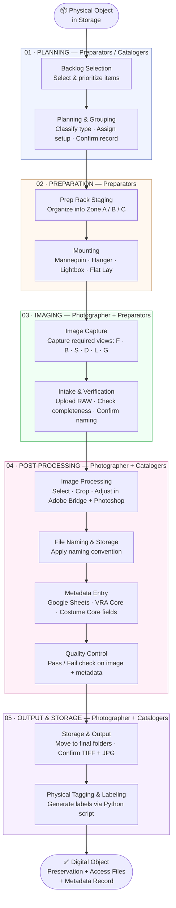
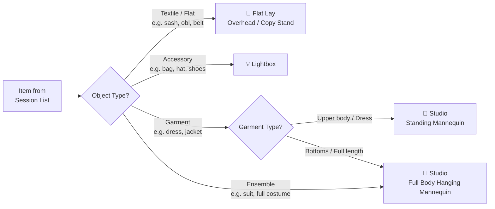

# Overview

This page provides a visual reference for the full imaging workflow — how items move through the system, what tools are used at each stage, and how the documentation is organized.

---

## Data Flow — Object to Digital Asset



---

## Imaging Setup by Object Type



---

## Tools by Stage

| Stage | Tools Used |
|---|---|
| **Planning** | Google Sheets (inventory + catalog records) |
| **Preparation** | Google Sheets (session tracking), physical rack + mannequins |
| **Imaging** | Camera (fixed + handheld), color card, lightbox, copy stand |
| **Post-Processing** | Adobe Bridge (file management + batch rename), Adobe Photoshop (editing + export) |
| **Output & Storage** | Controlled folder structure, Python script (label generation), Google Colab (optional batch processing) |

---

## FADGI Imaging Specifications

The following specifications are drawn from the *Technical Guidelines for Digitizing Cultural Heritage Materials* (FADGI, 3rd ed., 2023) and adapted for costume and textile digitization.

| Parameter | Specification | Notes |
|---|---|---|
| **Preservation format** | TIFF (uncompressed) | Master file — never re-save as TIFF after editing |
| **Access format** | JPG | Derivative for sharing and viewing |
| **Resolution** | 400 PPI minimum | For textiles: 600 PPI recommended to capture weave detail |
| **Bit depth** | 24-bit color (8-bit per channel) | Minimum for color items |
| **Color profile** | sRGB or Adobe RGB 1998 | Consistent across all sessions |
| **Color card** | Required in first frame of each batch | Use to verify color accuracy; remove for final output files |
| **Camera position** | Fixed per setup type | Do not change position mid-batch |
| **Lighting** | Consistent, diffused, no harsh shadows | Two-light minimum for studio setup |
| **File naming** | Per naming convention (see File Naming section) | Applied at Intake & Verification stage |

> **Color card note:** Capture one frame with the color card visible at the start of each batch. This frame is used for calibration and quality verification — it is not included in the final output files.

---

## Repository Structure (GitHub)

```
2D-Imaging-Workflow-SOP/
│
├── README.md                          ← Entry point / handbook overview
├── SUMMARY.md                         ← Navigation index
├── OVERVIEW.md                        ← This page — diagrams, tools, specs
│
├── docs/
│   ├── 01_Planning/
│   │   ├── Backlog_Selection.md
│   │   └── Planning_and_Grouping.md
│   │
│   ├── 02_Preparation/
│   │   ├── Prep_Rack.md
│   │   └── Mounting.md
│   │
│   ├── 03_Imaging/
│   │   ├── Photography.md
│   │   └── Intake_and_Verification.md
│   │
│   ├── 04_Post_Processing/
│   │   ├── Image_Processing.md
│   │   ├── File_Naming_and_Storage.md
│   │   ├── Metadata.md
│   │   └── Quality_Control.md
│   │
│   └── 05_Output_and_Storage/
│       ├── Storage_and_Output.md
│       └── Physical_Tagging_and_Box_Labeling.md
│
├── assets/
│   ├── diagrams/                      ← Exported workflow diagrams
│   └── screenshots/                   ← Adobe Bridge, Google Sheets, etc.
│
├── templates/
│   ├── catalog_sheet_template.xlsx    ← Catalog + session tracking
│   └── photography_checklist.xlsx     ← Per-session QC checklist
│
└── scripts/
    ├── generate_labels.py             ← Physical label generator
    └── generate_tags.py               ← File tag automation
```

---

## Navigation

| Stage | Page |
|---|---|
| Start here | [README](README.md) |
| Stage 01 | [Backlog Selection](docs/01_Planning/Backlog_Selection.md) · [Planning & Grouping](docs/01_Planning/Planning_and_Grouping.md) |
| Stage 02 | [Prep Rack](docs/02_Preparation/Prep_Rack.md) · [Mounting](docs/02_Preparation/Mounting.md) |
| Stage 03 | [Photography](docs/03_Imaging/Photography.md) · [Intake & Verification](docs/03_Imaging/Intake_and_Verification.md) |
| Stage 04 | [Image Processing](docs/04_Post_Processing/Image_Processing.md) · [File Naming](docs/04_Post_Processing/File_Naming_and_Storage.md) · [Metadata](docs/04_Post_Processing/Metadata.md) · [QC](docs/04_Post_Processing/Quality_Control.md) |
| Stage 05 | [Storage & Output](docs/05_Output_and_Storage/Storage_and_Output.md) · [Physical Labeling](docs/05_Output_and_Storage/Physical_Tagging_and_Box_Labeling.md) |
